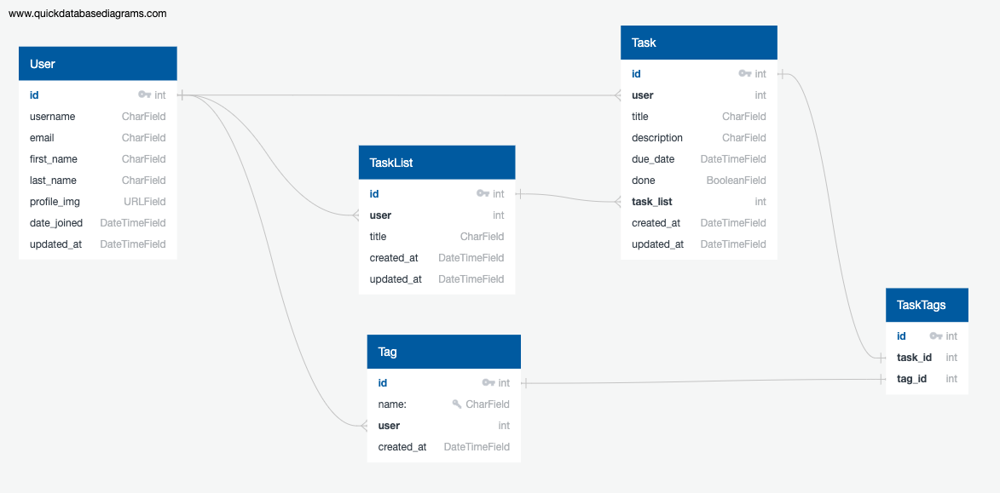

# Action Board API

##### Task Management Board

## Table of Contents

- [Overview](#overview)
  - [Introduction](#introduction)
  - [Live Project](#live-project)
  - [Live Docs](#live-docs)
  - [Database Design](#database-design)
  - [Technologies](#technologies)
- [Features](#features)
- [Installation](#installation)
- [Usage](#usage)
- [Future Improvements](#future-improvements)

## Overview

### Introduction

Action Board is a task management board designed to help individuals organize tasks, track progress, and work more effectively. This project was developed as part of General Assembly's Software Engineering Immersive (SEI) program. <br>

This project was developed independently utilising Python/Django and Django Rest Framework and serves a ReactJS frontend which is located here: [frontend deployment here](https://github.com/ladeoshodi/action-board)

### Live Project

[Play with the live project here](https://action-board.netlify.app)

Demo user login

```
username: demouser@example.com
password: demouser
```

### Live Docs

- [Swagger UI here](https://action-board-api-4769d6be906d.herokuapp.com/api-docs/swagger-ui/)
- [Redoc here](https://action-board-api-4769d6be906d.herokuapp.com/api-docs/redoc/)

### Database design



### Technologies

- 
- 
- 
- Django REST Framework
- Python Unittest

## Features

- Users can register and login to their account
- Users can update and delete their account
- Users can create, read, update and delete tasklists
- Users can create, read, update and delete tasks
- Users can create, read and delete tags

## Installation

1. Clone the repository:

   ```sh
   git clone https://github.com/ladeoshodi/action-board-api.git
   cd action-board-api
   ```

2. Create and activate a virtual environment:

   ```sh
   pip install --user pipenv
   pipenv shell
   ```

3. Install dependencies:

   ```sh
   pipenv install
   ```

4. Set up environment variables:

   ```sh
   touch .env
   echo SECRET_KEY=YOUR_SECRET_KEY >> .env
   echo DATABASE_NAME=YOUR_DATABASE_NAME >> .env
   echo ENVIRONMENT=DEV >> .env
   ```

5. Apply migrations:

   ```sh
   python manage.py migrate
   ```

6. Run the development server

   ```sh
   python manage.py runserver
   ```

7. Run Tests
   ```sh
   python manage.py test
   ```

## Usage

- Access the admin panel at `/admin/`
- API endpoints:
  - `/api/user/` - User-related endpoints
  - `/api/tags/` - Tag-related endpoints
  - `/api/tasklists/` - Task list-related endpoints
  - `/api/tasks/` - Task-related endpoints
